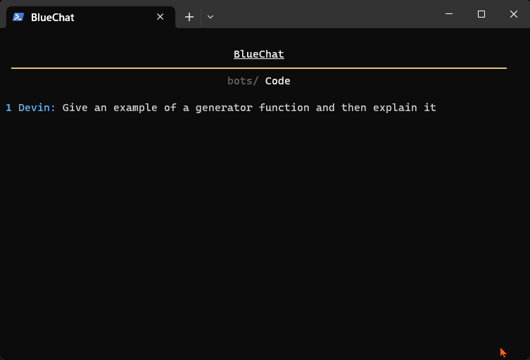
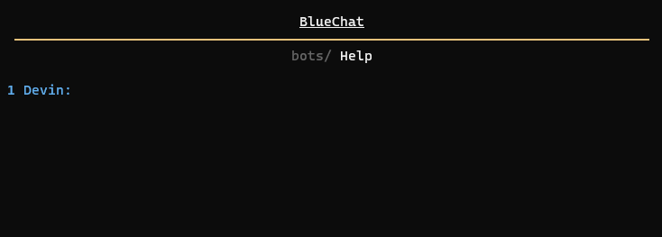

# BlueChat

A conversational engine for experimenting with OpenAI GPT Chat API. Enables a basic 2-way conversation between the user and an AI, or between two AIs.

* Create custom prompts to chat with any AI and seamlessly switch between them (e.g., story characters, assistants, teachers)
* Automatically save chats and easily continue past conversations
* Dynamically summarize conversations to enhance memory and reduce token costs
* More reliable and likely cheaper than a ChatGPT subscription (depending on usage)
* Chat with your AIs via the terminal like you're in a sci-fi movie




---

## Installation

1. Download the project from [GitHub](https://github.com/DevinBerchtold/BlueChat)
2. Install the required Python libraries:
    * [OpenAI](https://platform.openai.com/docs/api-reference/introduction?lang=python)
    * [tiktoken](https://github.com/openai/tiktoken)
    * [Rich](https://pypi.org/project/rich/)
    * [Pyperclip](https://pypi.org/project/pyperclip/)
    * [PyYAML](https://pypi.org/project/PyYAML/) (Recommended)
3. Add your OpenAI API key:

    ```
    setx OPENAI_API_KEY "your key"
    ```

    [Best Practices for API Key Safety](https://help.openai.com/en/articles/5112595-best-practices-for-api-key-safety)

---

## Usage

1. Run it:

    ```
    py chat.py
    ```

2. Talk as though you are a cute puppy or ask questions to one of the many assistants.

3. Create new AIs to chat with by adding a YAML file with their system message.

---

## Commands

Commands begin with `!`. Everything else will be interpreted as conversation.

`<!print|!messages>`: Print the messages object.

`<!history|!h>`: Print full conversation history.

`<!save|!s> [filename]`: Save the messages file to JSON/YAML.

`<!load|!l> [filename]`: Load a messages file from JSON/YAML.

`<!copy|!c> [all|code|n]`: Copy `n` latest messages to the clipboard. Only copy code blocks if `code` is specified.

`<!paste|!p>`: Paste a multi-line input from the clipboard (bypass terminal limitations).

`<!summary|!sum> [num_tokens]`: Summarize `num_tokens` or the conversation so far.

`<!translate|!t> [ai_lang] [user_lang]`: Turn Translate Mode on or off.

`<!model|!m> [model]`: Changes LLM model if `model` specified. Otherwise, prints current model.

`<!auto|!a>`: Toggle automatic switch mode on or off.

`<!undo|!u>`: Go back one step in the conversation.

`<!debug|!d>`: Toggle debug mode on or off.

`<!variable|!v> [variable]=[value]`: Set a variable value.

`<!restart|!r>`: Delete all messages except system message and restart conversation.

`<!exit|!x>`: Exit program.

---

## Customization

Add new AIs by adding YAML files to the `conversations` folder. As an example lets make a new bot, `emoji.yaml`

```yaml 
- role: system
  content: You are a helpful assistant that uses lots of emojis.
```

Add a description in `bots.yaml` to enable automatic context switching based on the user's input. This allows you to automatically chat with the most relevant bot for your task/question.

```yaml
# Variables: User, default bot, last bot, context switching toggle
variables: {USER_NAME: Devin, DEFAULT: help, FILENAME: code, SWITCH: true}
bots:
  fact: Gives encyclopedia entries for things and ideas.
  # ...
  # Key is the filename for your bot. Value is the description used for context switching
  emoji: General help. Responds when user sends emojis.
```

Now, EmojiBot will automatically respond when the criteria in `bots.yaml` is met.



---

## Cost

Costs increase linearly on the length of the conversation. Previous messages are included for the character's memory. We can facilitate 'infinite' memory by recursively summarizing old messages when the token limit is reached. After the conversations reach a certain length (about 50 messages at max memory), the cost would average 2048-4096 tokens per response. The memory can be limited to reduce costs.

---

## Credits

This project uses [OpenAI API](https://platform.openai.com/) for AI functionality

Dedicated to Blue Berchtold

---

## License

This project is released under the MIT license:

[MIT License](https://choosealicense.com/licenses/mit/)